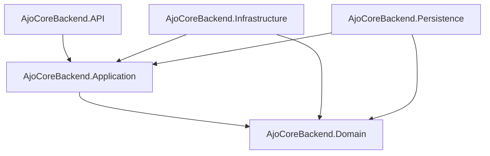

# AjoCore Backend


> A Smart Cooperative Savings REST API for Nigerians.

## Overview

AjoCore is a fintech platform designed to digitize informal cooperative savings groups—traditionally known as Ajo or Esusu in Nigeria. It brings structure, transparency, and automation to group-based savings, personal savings, and rotational payouts. 

By integrating modern payment infrastructure (Nomba API) and maintaining a robust ledger system, AjoCore eliminates the trust issues, manual tracking errors, and fraud commonly associated with traditional Ajo savings schemes.

## Features

- **Cooperative Group Management**: Create, join, and manage cooperative groups.
- **Saving Cycles**: Support for Personal savings, ROSCA (Rotational), and ASCA (Accumulated) cycles.
- **Rotational Payouts**: Automated scheduling and execution of rotational payouts.
- **Contribution Tracking**: Granular tracking of user contributions via a dedicated ledger.
- **Virtual Accounts**: Seamless integration with Nomba to provision dynamic virtual accounts for users.
- **Webhook Processing**: Real-time recording of inbound transactions through Nomba Webhooks.
- **Automated Background Jobs**: Scheduled tasks for liquidation sweeps, payment reminders, and reversal processing via Hangfire.
- **Notifications**: Transactional emails powered by Brevo.

## Tech Stack

| Technology | Purpose |
|------------|---------|
| **.NET 10** | Core web framework for building the REST API |
| **C#** | Primary programming language |
| **EF Core** | Object-Relational Mapper (ORM) for data access |
| **PostgreSQL** | Primary relational database |
| **MediatR** | Implements the CQRS pattern for commands and queries |
| **FluentValidation** | Request validation and business rule enforcement |
| **AutoMapper** | Object-to-object mapping (DTOs to Entities) |
| **Hangfire** | Reliable background job processing and scheduling |
| **Nomba API** | External payment provider for virtual accounts and transfers |
| **Brevo (Sendinblue)** | External email service provider for notifications |
| **NSwag** | OpenAPI/Swagger documentation generation |
| **Docker** | Containerization for consistent deployment |
| **Railway** | Cloud hosting provider for application and database |

## Architecture

AjoCore strictly follows **Clean Architecture** (Onion Architecture). The system is organized into five distinct layers to enforce separation of concerns, ensuring that the core domain logic remains independent of external frameworks and delivery mechanisms.



- **Domain Layer**: Houses core entities, value objects, exceptions, and enumerations. It has zero external dependencies.
- **Application Layer**: Contains business use cases (CQRS Commands/Queries), DTOs, Validation rules, and Interfaces.
- **Infrastructure Layer**: Implements external concerns like Nomba HTTP clients, Brevo SMTP integration, and Hangfire background jobs.
- **Persistence Layer**: Implements the `DbContext`, EF Core migrations, and generic repository patterns.
- **Presentation (API) Layer**: The entry point exposing REST endpoints, configuring dependency injection, and handling HTTP requests.

## Project Structure

```text
AjoCore - Backend/
├── AjoCoreBackend.API/             # Controllers, Middlewares, Program.cs
├── AjoCoreBackend.Application/     # CQRS, DTOs, Validators, Mappings, Interfaces
├── AjoCoreBackend.Domain/          # Core Entities, Enums, Exceptions
├── AjoCoreBackend.Infrastructure/  # External API Clients, Background Jobs, Email Service
├── AjoCoreBackend.Persistence/     # DbContext, Migrations, Repositories
├── Dockerfile                      # Multi-stage Docker build configuration
├── .gitignore                      # Git ignored files
└── README.md                       # Project documentation
```

## Getting Started / Prerequisites

### Prerequisites
- [.NET 10 SDK](https://dotnet.microsoft.com/download/dotnet/10.0)
- PostgreSQL Server
- Docker (optional, for containerized local development)

### Local Setup

1. **Clone the repository:**
   ```bash
   git clone https://github.com/Adeyemiadigun/AjoCore--Frontend.git
   cd "AjoCore - Backend"
   ```

2. **Configure Environment Variables:**
   Create a `.env` file inside the `AjoCoreBackend.API` directory (or the root if specified by your runtime), mapping to the values in `appsettings.json`.
   ```bash
   touch AjoCoreBackend.API/.env
   ```
   *(Populate it using the Environment Variables table below).*

3. **Restore Packages:**
   ```bash
   dotnet restore
   ```

4. **Run Database Migrations:**
   Ensure your PostgreSQL instance is running and the connection string is valid.
   ```bash
   cd AjoCoreBackend.Persistence
   dotnet ef database update --startup-project ../AjoCoreBackend.API
   ```

5. **Run the Application:**
   ```bash
   cd ../AjoCoreBackend.API
   dotnet run
   ```
   *The Swagger UI will be available at `http://localhost:<port>/swagger`.*

## Environment Variables

The application relies on `.env` files parsed by `DotNetEnv` on startup.

| Variable | Description | Example |
|----------|-------------|---------|
| `ConnectionStrings__DefaultConnection` | PostgreSQL connection string | `Host=localhost;Database=ajocore;Username=postgres;Password=secret` |
| `Jwt__Secret` | Secret key for signing JWTs | `super_secret_key_12345` |
| `Jwt__Issuer` | Token issuer domain | `ajocore.com` |
| `Jwt__Audience` | Token audience domain | `ajocore.com` |
| `Jwt__ExpirationHours` | Token validity duration | `24` |
| `Nomba__BaseUrl` | Base URL for Nomba API | `https://api.nomba.com/v1` |
| `Nomba__AccountId` | Nomba Account ID | `acc_xyz123` |
| `Nomba__ClientId` | Nomba Client ID | `client_abc` |
| `Nomba__ClientSecret` | Nomba Secret | `secret_def` |
| `Nomba__WebhookSigningKey` | Secret for validating Nomba hooks | `whsec_xxx` |
| `Nomba__SubAccountId` | Parent Sub-account ID | `sub_xxx` |
| `EmailSettings__SmtpServer` | SMTP Server (Brevo) | `smtp-relay.brevo.com` |
| `EmailSettings__SmtpPort` | SMTP Port | `587` |
| `EmailSettings__SenderName` | Sender Name | `AjoCore Support` |
| `EmailSettings__SenderEmail` | Sender Email | `support@ajocore.app` |
| `EmailSettings__Username` | SMTP Username | `user@example.com` |
| `EmailSettings__Password` | SMTP Password | `smtp_secret_pass` |

## API Endpoints

### Auth
| Method | Route | Description | Auth Required |
|--------|-------|-------------|---------------|
| `POST` | `/api/auth/register` | Register a new user | No |
| `POST` | `/api/auth/verify-email` | Verify email address | No |
| `POST` | `/api/auth/login` | Trader login | No |
| `POST` | `/api/auth/admin-login` | Admin login | No |
| `POST` | `/api/auth/refresh` | Refresh JWT token | No |
| `POST` | `/api/auth/forgot-password` | Initiate password reset | No |
| `POST` | `/api/auth/reset-password` | Complete password reset | No |
| `POST` | `/api/auth/update-bvn` | Update Trader BVN | Yes (Trader) |
| `PUT`  | `/api/auth/payout-account`| Update payout account | Yes |

### Profile
| Method | Route | Description | Auth Required |
|--------|-------|-------------|---------------|
| `GET`  | `/api/profile/trader` | Get Trader profile | Yes (Trader) |
| `PUT`  | `/api/profile/trader` | Update Trader profile | Yes (Trader) |
| `PUT`  | `/api/profile/trader/bvn` | Update Trader BVN | Yes (Trader) |
| `PUT`  | `/api/profile/trader/payout` | Update Trader payout details | Yes (Trader) |
| `GET`  | `/api/profile/cooperative-admin` | Get Coop Admin profile | Yes (CoopAdmin) |
| `PUT`  | `/api/profile/cooperative-admin` | Update Coop Admin profile | Yes (CoopAdmin) |
| `GET`  | `/api/profile/system-admin` | Get System Admin profile | Yes (SysAdmin) |
| `PUT`  | `/api/profile/system-admin` | Update System Admin profile | Yes (SysAdmin) |

### Cooperative Groups
| Method | Route | Description | Auth Required |
|--------|-------|-------------|---------------|
| `GET`  | `/api/groups` | Search all cooperative groups | No |
| `GET`  | `/api/groups/{id}` | Get group details | No |
| `POST` | `/api/groups` | Create cooperative group | Yes (CoopAdmin) |
| `POST` | `/api/groups/{groupId}/join` | Request to join group | Yes |
| `GET`  | `/api/groups/{groupId}/requests` | View pending join requests | Yes (CoopAdmin) |
| `POST` | `/api/groups/requests/{membershipId}/approve` | Approve join request | Yes (CoopAdmin) |
| `POST` | `/api/groups/requests/{membershipId}/reject` | Reject join request | Yes (CoopAdmin) |
| `GET`  | `/api/groups/{groupId}/members` | Get approved group members | Yes |
| `GET`  | `/api/groups/{groupId}/invite-link` | Generate invite link | Yes (CoopAdmin) |
| `POST` | `/api/groups/{groupId}/members/add` | Bulk add members | Yes (CoopAdmin) |
| `POST` | `/api/groups/{groupId}/deactivate` | Deactivate a group | Yes (CoopAdmin) |
| `DELETE`| `/api/groups/{groupId}/members/{membershipId}` | Remove a member | Yes (CoopAdmin) |
| `GET`  | `/api/groups/{groupId}/payouts` | View group payouts ledger | Yes (CoopAdmin) |
| `GET`  | `/api/groups/{groupId}/contributions` | View group contributions ledger | Yes (CoopAdmin) |

### Saving Cycles
| Method | Route | Description | Auth Required |
|--------|-------|-------------|---------------|
| `POST` | `/api/saving-cycles` | Create cycle for a group | Yes (CoopAdmin) |
| `POST` | `/api/saving-cycles/individual` | Create personal cycle | Yes |
| `GET`  | `/api/saving-cycles` | Get all cycles | Yes |
| `GET`  | `/api/saving-cycles/individual` | Get individual cycles | Yes |
| `GET`  | `/api/saving-cycles/personal/{id}`| Get personal cycle details | Yes |
| `GET`  | `/api/saving-cycles/rosca/{id}` | Get ROSCA cycle details | Yes |
| `GET`  | `/api/saving-cycles/asca/{id}` | Get ASCA cycle details | Yes |
| `GET`  | `/api/saving-cycles/{id}/members` | Get members of a cycle | Yes (CoopAdmin) |
| `GET`  | `/api/saving-cycles/{id}` | Get cycle by ID | Yes |
| `GET`  | `/api/saving-cycles/{id}/my-details`| Get my cycle summary | Yes |
| `GET`  | `/api/saving-cycles/my-personal` | Get my personal cycles | Yes |
| `POST` | `/api/saving-cycles/{id}/liquidate-early`| Early liquidation | Yes |
| `POST` | `/api/saving-cycles/{id}/join` | Join a saving cycle | Yes |
| `POST` | `/api/saving-cycles/{id}/start` | Start a saving cycle | Yes (CoopAdmin) |
| `GET`  | `/api/saving-cycles/members/{memberId}/contributions` | Get member's contributions | Yes |
| `GET`  | `/api/saving-cycles/members/{memberId}/payouts` | Get member's payouts | Yes |
| `POST` | `/api/saving-cycles/{id}/members/{memberId}/approve` | Approve cycle member | Yes (CoopAdmin) |
| `POST` | `/api/saving-cycles/{id}/members/{memberId}/reject` | Reject cycle member | Yes (CoopAdmin) |
| `POST` | `/api/saving-cycles/{id}/members/reorder` | Reorder payout slots | Yes (CoopAdmin) |

### Balances & Banks
| Method | Route | Description | Auth Required |
|--------|-------|-------------|---------------|
| `GET`  | `/api/balances/system` | System wallet balance | Yes (SysAdmin) |
| `GET`  | `/api/balances/cooperative/{groupId}` | Group balance | Yes (CoopAdmin) |
| `GET`  | `/api/balances/cycle/{cycleId}` | Cycle balance | Yes (CoopAdmin) |
| `GET`  | `/api/balances/my-balances` | Trader aggregated balance | Yes |
| `GET`  | `/api/balances/nomba-wallet` | Actual Nomba subaccount bal | Yes (SysAdmin) |
| `POST` | `/api/balances/withdraw-nomba-funds` | Withdraw from Nomba | Yes (SysAdmin) |
| `GET`  | `/api/banks` | List all valid banks | No |
| `GET`  | `/api/banks/lookup` | Resolve account name | No |

### Webhooks & Admins
| Method | Route | Description | Auth Required |
|--------|-------|-------------|---------------|
| `POST` | `/api/webhooks/nomba` | Nomba Transaction webhook | No (Signature Verif.) |
| `GET`  | `/api/users` | List all users | Yes (SysAdmin) |

## Database Schema

The persistence layer uses EF Core Code-First Migrations targeting **PostgreSQL**.
Key Entities:
- **Trader**, **CooperativeAdmin**, **SystemAdmin**: Inherit from `BaseEntity`. Used for user profiling.
- **CooperativeGroup**: A collective of Traders. Has a one-to-many relationship with `CooperativeGroupMember`.
- **SavingCycle**: Belongs to a Group (or personal). Contains `SavingCycleMember` entries.
- **RotationalSlot**: Maps payout schedules to users in ROSCA schemes.
- **NombaVirtualAccount**: Tracks the dynamic virtual account mapped to Traders.
- **Ledgers**: `ContributionLedger` (tracks inbound funds), `PayoutLedger` (tracks distributions), `ReversalLedger` (failed transactions).

## Background Jobs

AjoCore leverages **Hangfire** for scheduling and processing out-of-band tasks reliably:

1. **LiquidationSweepService**: Scans for completed saving cycles or triggered early-liquidations and initiates the payout workflows.
2. **ReversalProcessingService**: Evaluates failed or reverted Nomba transfers and triggers reconciliation logic.
3. **SavingReminderService**: Checks for upcoming or overdue contributions and dispatches email/SMS reminders to Traders.

## Deployment

AjoCore utilizes a multi-stage `Dockerfile` and is hosted on **Railway**. 

**Docker Build & Run:**
```bash
docker build -t ajocore-backend .
docker run -p 8080:8080 --env-file .env ajocore-backend
```

**Railway Deployment:**
- Connect the GitHub repository directly to a Railway service.
- The `Dockerfile` natively dictates the build steps.
- Configure Railway's variable dashboard with the parameters from `.env`.
- Database Migrations execute automatically on startup via `context.Database.Migrate()` in `Program.cs`.

## Contributing

1. Fork the project.
2. Create your feature branch (`git checkout -b feature/AmazingFeature`).
3. Commit your changes (`git commit -m 'Add some AmazingFeature'`).
4. Push to the branch (`git push origin feature/AmazingFeature`).
5. Open a Pull Request.
6. Ensure all new logic is covered with relevant unit/integration tests and passes CQRS validation.

## License

This project is licensed under the MIT License.

## Authors / Contact

- Developed by the AjoCore Team
- Support Contact: [support@ajocore.app](mailto:oriolowomustapha@gmail.com)
